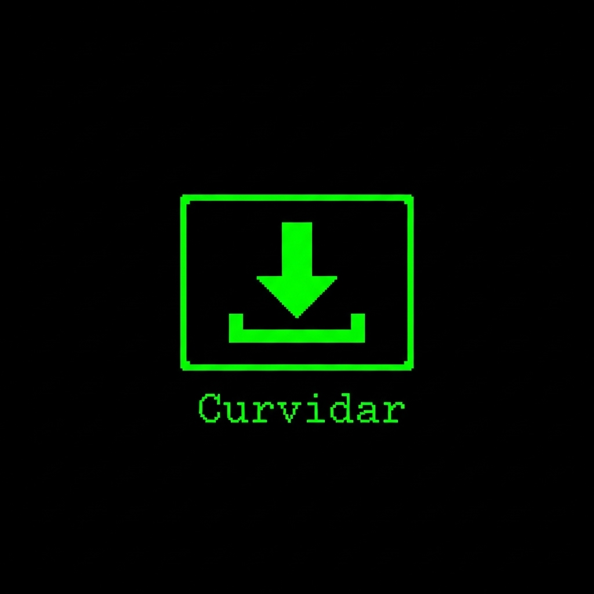

# Curvidar
A simple one-command script to set up Termux for easy YouTube video/audio downloads via the share menu.
# Curvidar: Termux YouTube Downloader 

<p align="center">
  
</p>


[](https://github.com/currentvai)

**Curvidar** is a one-command script to set up your Termux for downloading YouTube videos and audio with an interactive menu, just by sharing a link.

This script installs all necessary tools like `yt-dlp`, `ffmpeg`, and `aria2c`, and then configures the `termux-url-opener` for a seamless experience.

## Features
-   🚀 **One-Command Setup**: Run one script and you are ready to go.
-   🎬 **Interactive Menu**: Choose video quality (1080p, 720p, 480p) or audio format (m4a, mp3).
-   ⚡️ **Fast Downloads**: Uses `aria2c` for accelerated, multi-connection downloads.
-   🎵 **Audio & Video**: Download both video and audio-only files.
-   🖼️ **Metadata & Thumbnails**: Automatically embeds metadata and thumbnails.
-   📁 **Organized**: All downloads are saved to the `storage/shared/YouTube` folder.

🔧 Curvidar Setup Guide (For Termux Users)

## Installation
📌 Step 1: Update & Upgrade Packages
```bash
pkg update -y && pkg upgrade -y
```

✅ This updates all your existing Termux packages to the latest version.

📌 Step 2: Install Git
```bash
pkg install git -y
```

✅ Installs Git, which is required to clone the repository.

📌 Step 3: Clone the Curvidar Repository
```bash
git clone https://github.com/currentvai/Curvidar.git
```

✅ Downloads the Curvidar project from GitHub.

📌 Step 4: Enter the Project Directory
```bash
cd Curvidar
```

✅ Moves into the Curvidar folder.

📌 Step 5: Make the Setup Script Executable
```bash
chmod +x setup.sh
```

✅ Grants permission to run the setup script.

📌 Step 6: Run the Setup Script
```bash
./setup.sh
```

Now change the opener path 
```bash
cd ~
mkdir -p bin
mv Curvidar/termux-file-opener.txt bin/termux-url-opener
chmod +x bin/termux-url-opener

```

✅ Starts the automatic installation and configuration.

✅ One-Line Command (All Steps Together)

If you want to run everything at once, just use this:
```bash
pkg update -y && pkg upgrade -y && pkg install git -y && git clone https://github.com/currentvai/Curvidar.git && cd Curvidar && chmod +x setup.sh && ./setup.sh
```
✅ After Successful Installation
You’re all set! 

---
🔄 One-Click Update Command

To update the Curvidar tool to the latest version, just run the following command in Termux or Linux:

cd $HOME/Curvidar && git pull && chmod +x *.sh && echo "✅ Curvidar Update!"

---

Now you can **download any video easily** in just a few steps.

**⚙️ One-Time Setup (Required)**

To enable the floating download feature:

**Long-press** the **Termux** app icon.

Tap on **App Info.**

Go to **Display over other apps.**

**Enable** the toggle.

---

🔓 This allows Termux to appear as an option when sharing videos.

**🎬 How to Download a Video**

Open your desired video (e.g., on YouTube, Facebook, etc.).

Tap the **Share** button.

From the list, choose **Termux.**

Select your preferred **video quality.** (e.g., 1/2/etc.)

The download will begin automatically.

---

**📁 Where to Find the Downloaded Video?**

All videos will be saved in the:
```pgsql
Internal Storage > Youtube
```

---

⚠️ **Disclaimer
This tool is intended for personal and educational use only.**

**Please respect the copyrights of content creators.**

❗ **The developer is not responsible for any misuse of this script.**

---

## 🛠️ Developer Info

**Developed with ❤️ by [Current Vai ♚](https://github.com/currentvai)**  
📬 Contact: [@CurrentVai on Telegram](https://t.me/currentVai)

---**© Copyright 2025 — All Rights Reserved.**

---

## 🌐 Connect

- 💬 Telegram: [@CurrentVai](https://t.me/currentVai)
- 🐙 GitHub: [Current7777](https://github.com/currentvai)

---

## 📢 License

This project is licensed under the **MIT License**.

If you want to give me any advice, feel free to contact me.👇👇👇

Telegram: [@CurrentVai](https://t.me/currentvai) 

